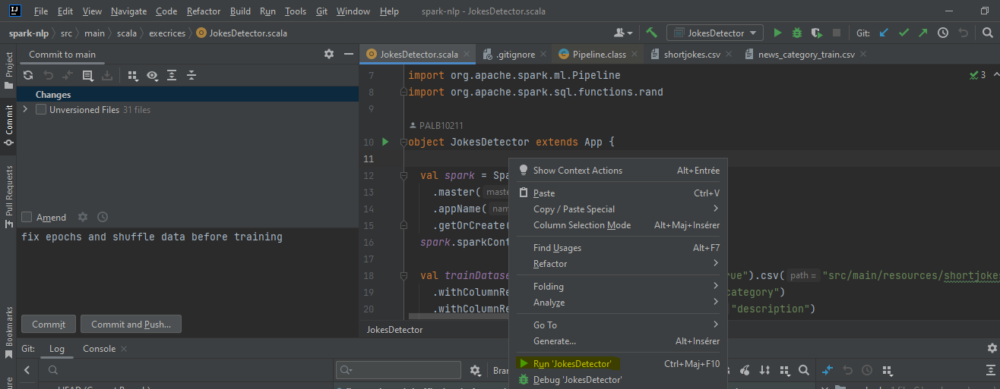

# spark-nlp

First Build the project by running this command on the root of the project:
```
mvn clean package
```
Run your class by right clicking on the class you want to run and then click on Run 'ClassName'.

Ex:


